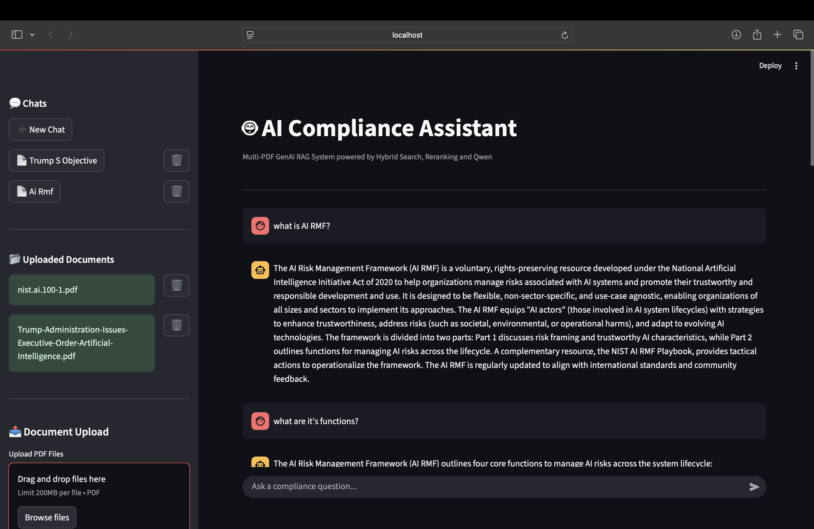
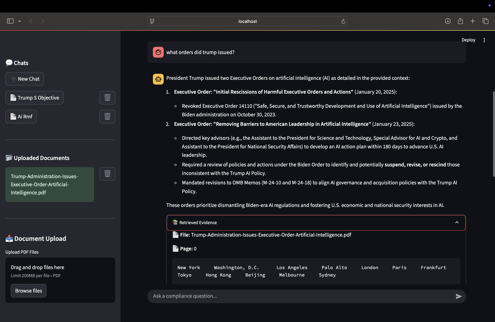

# 🤖 AI Compliance Assistant

A **Multi-PDF Retrieval-Augmented Generation (RAG) application** that enables users to chat with multiple compliance documents using **Hybrid Search (FAISS + BM25)**, **CrossEncoder Reranking**, and **Groq LLM**.

The application supports **multiple independent chat sessions**, allowing users to upload different PDF collections into separate conversations while maintaining isolated vector databases and chat histories.

---

## 🚀 Features

- 💬 Multiple independent chat sessions
- 📄 Multi-PDF document support
- 🔍 Hybrid Search (FAISS + BM25)
- 🎯 CrossEncoder reranking
- 🤖 Groq LLM integration
- 📝 Automatic conversation titles
- 🗑️ Delete chats
- 📂 Delete uploaded PDFs with automatic vectorstore rebuilding
- 📑 Retrieved chunk visualization
- 📚 Source citation support
- ⚡ Fast retrieval using cached retrievers
- 💾 SQLite chat history
- 🌐 Cross-platform support (Windows & macOS)

---

## 📸 Demo

### Main Interface

> The main interface demonstrating multi-chat support, PDF management, grounded responses.



---

### Retrieved Chunks

> Retrieved evidence showing the supporting document chunks used to generate the response.



---

## 🏗️ Architecture

```
                    User
                      │
                      ▼
             Streamlit Frontend
                      │
        ┌─────────────┴─────────────┐
        │                           │
        ▼                           ▼
 Chat Management              PDF Upload
(SQLite Database)                  │
                                    ▼
                             Text Chunking
                                    │
                                    ▼
                       HuggingFace Embeddings
                                    │
                                    ▼
                              FAISS Vector DB
                                    │
                     ┌──────────────┴──────────────┐
                     ▼                             ▼
                 BM25 Search                FAISS Search
                     │                             │
                     └──────────Hybrid Search──────┘
                                    │
                                    ▼
                       CrossEncoder Reranker
                                    │
                                    ▼
                              Groq LLM
                                    │
                                    ▼
                         Answer + Citations
```

---

## 🛠️ Tech Stack

### Frontend

- Streamlit

### Backend

- Python

### Database

- SQLite

### RAG Pipeline

- LangChain
- FAISS
- BM25 Retriever
- CrossEncoder
- HuggingFace Embeddings

### LLM

- Groq
- Qwen

### Libraries

- Sentence Transformers
- Transformers
- Scikit-Learn
- PyPDF

---

## 📂 Project Structure

```text
AI-Compliance-Assistant/
│
├── app.py
├── database.py
├── rag_pipeline.py
├── requirements.txt
├── .env.example
├── .gitignore
│
├── notebooks/
│   └── Genai_doc_retriever.ipynb
│
└── tests/
```

---

## ⚙️ Installation

```bash
git clone https://github.com/ganeshreddy101/AI-Compliance-Assistant.git

cd AI-Compliance-Assistant

python -m venv .venv

source .venv/bin/activate
```

Install dependencies

```bash
pip install -r requirements.txt
```

---

## 🔑 Environment Variables

Create a `.env` file.

```env
GROQ_API_KEY=your_api_key_here
HF_TOKEN=your_huggingface_token
```

---

## ▶️ Run

```bash
streamlit run app.py
```

---

## 🎯 Future Improvements

- Persistent retrieved evidence
- Streaming responses
- Chat search
- Rename chats
- OCR support
- DOCX support
- Image understanding
- User authentication
- Cloud database

---

## 👨‍💻 Author

**Ganesh Reddy**

LinkedIn: https://www.linkedin.com/in/karedla-ganesh-reddy/

GitHub: https://github.com/ganeshreddy101

---