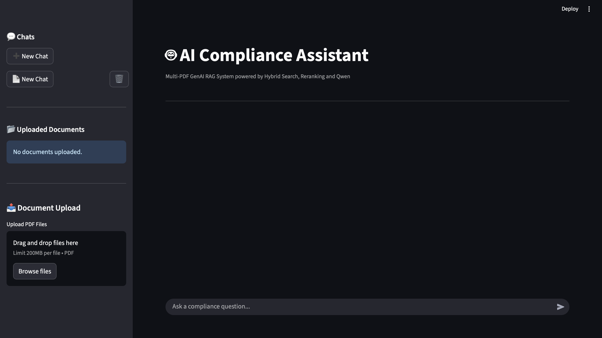
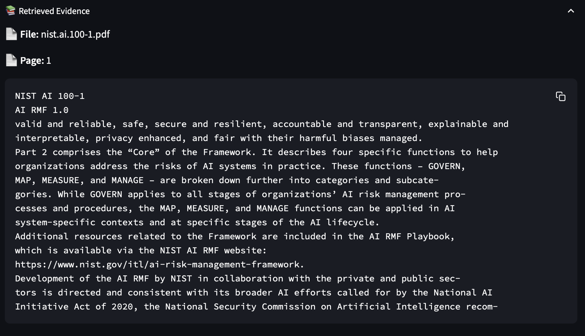
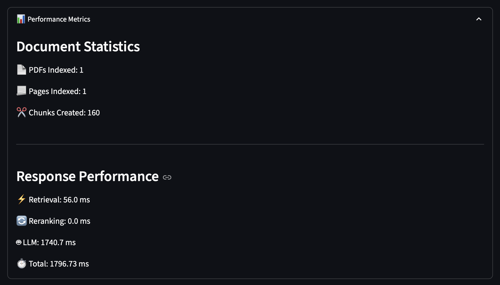

# 🤖 AI Compliance Assistant

**Compliance teams** waste hours manually searching through dense regulatory documents like NIST AI RMF, OECD AI Principles, and government executive orders. This tool lets them ask questions in plain English and get accurate, cited answers in seconds — across multiple documents simultaneously.

A **Multi-PDF Retrieval-Augmented Generation (RAG) application** that enables users to chat with multiple compliance documents using **Hybrid Search (FAISS + BM25)**, **CrossEncoder Reranking**, and **Groq LLM**.

The application supports **multiple independent chat sessions**, allowing users to upload different PDF collections into separate conversations while maintaining isolated vector databases and chat histories.

---

## 🚀 Features

- 💬 Multiple independent chat sessions
- 📄 Multi-PDF document support
- 🔍 Hybrid Search (FAISS + BM25)
- 🎯 CrossEncoder reranking
- 🤖 Groq LLM integration
- 📝 Automatic conversation titles
- 🗑️ Delete chats
- 📂 Delete uploaded PDFs with automatic vectorstore rebuilding
- 📑 Retrieved chunk visualization
- 📚 Source citation support
- ⚡ Fast retrieval using cached retrievers
- 💾 SQLite chat history
- 🌐 Cross-platform support (Windows & macOS)

---

## 📸 Demo

### 🏠 Main Dashboard

The main interface demonstrating multi-chat support, PDF management, and AI-generated responses.

<p align="center">
  
</p>

---

### 📚 Retrieved Evidence

Displays the supporting document chunks retrieved by the Hybrid RAG pipeline before answer generation.

<p align="center">
  
</p>

---

### 📊 Performance Metrics

Shows retrieval statistics and execution metrics to help evaluate system performance.

<p align="center">
  
</p>

---

## 🏗️ Architecture

```text
                           User
                             │
                             ▼
                    Streamlit Frontend
                             │
         ┌───────────────────┴───────────────────┐
         │                                       │
         ▼                                       ▼
  Chat Management                         PDF Upload
 (SQLite Database)                             │
                                                ▼
                                     PyMuPDF Text Extraction
                                                │
                                                ▼
                                  Recursive Text Chunking
                                                │
                                                ▼
                          HuggingFace Embeddings (MiniLM)
                                                │
                           ┌────────────────────┴────────────────────┐
                           ▼                                         ▼
                    FAISS Vector Store                        BM25 Index
                           │                                         │
                           └────────────── Hybrid Retrieval ──────────┘
                                              │
                                              ▼
                                  Cross-Encoder Re-ranking
                                              │
                                              ▼
                                  Conversation Memory
                                              │
                                              ▼
                                  Llama 3.3 (Groq API)
                                              │
                     ┌────────────────────────┴────────────────────────┐
                     ▼                                                 ▼
             AI Generated Answer                         Retrieved Evidence
                                                          + Performance Metrics
```

---

## 🛠️ Tech Stack
| Category        | Technology |
|-----------------|------------|
| Frontend        | Streamlit 
| Backend         | Python 
| LLM             | Llama 3.3 (Groq) 
| Framework       | LangChain 
| Vector Database | FAISS 
| Retrieval       | BM25 
| Re-ranking      | Cross Encoder 
| Embeddings      | all-MiniLM-L6-v2 
| Database        | SQLite 
| PDF Processing  | PyMuPDF 

### RAG Pipeline

- LangChain
- FAISS
- BM25 Retriever
- CrossEncoder
- HuggingFace Embeddings

### LLM

- Groq
- Llama 3.3 70B

### Libraries

- Sentence Transformers
- Transformers
- Scikit-Learn
- PyMuPDF

---

## 📂 Project Structure

```text
AI-Compliance-Assistant/
│
├── app.py
├── database.py
├── rag_pipeline.py
├── requirements.txt
├── .env.example
├── .gitignore
│
├── notebooks/
│   └── Genai_doc_retriever.ipynb
│
└── tests/
```

---

## ⚡ Performance Improvements

| Metric | Before | After |
|---------|--------|-------|
| PDF Processing | Docling | PyMuPDF |
| Processing Time | 75.34 s | 0.46 s |
| Improvement | — | **~164× Faster** |

---
## 📈 Evaluation

### Methodology
The system was evaluated using an **LLM-as-Judge** approach on a benchmark set of
80 manually curated questions spanning multiple AI compliance documents. Each
generated response was assessed for factual correctness against the source document
— verifying that answers were grounded in retrieved context and free from
hallucinations.

### Evaluation Dataset
Questions were drawn from the following compliance frameworks:
- NIST AI Risk Management Framework (NIST AI RMF 1.0)
- OECD AI Principles
- Executive Order on AI Leadership (Trump Administration, 2025)

### Results
- ✅ 80 benchmark questions evaluated
- ✅ 0 factually incorrect answers detected
- ✅ Hybrid Retrieval (FAISS + BM25) + Cross-Encoder Re-ranking consistently
  improved context relevance across all evaluated documents

---

## ⚙️ Installation

```bash
git clone https://github.com/ganeshreddy101/AI-Compliance-Assistant.git

cd AI-Compliance-Assistant

python -m venv .venv

source .venv/bin/activate
```

Install dependencies

```bash
pip install -r requirements.txt
```

---

## 🔑 Environment Variables

Create a `.env` file.

```env
GROQ_API_KEY=your_api_key_here
HF_TOKEN=your_huggingface_token
```

---

## ▶️ Run

```bash
streamlit run app.py
```

---

🎯 Future Improvements:

🗺️ Roadmap

☁️ Cloud Deployment (AWS/Azure)
   Currently hosted on Streamlit Community Cloud. Production deployment
   would use containerized FastAPI backend + managed vector store for
   multi-user scalability.

🗂️ Persistent Vector Database
   Vector stores currently rebuild per session. Switching to Pinecone or
   Weaviate would enable persistence, faster startup, and shared indexes.

📑 Citation-Aware Responses
   Responses currently show retrieved chunks separately. Next step is
   inline citations within the answer itself (e.g., [NIST AI RMF, p.12]).

🖼️ OCR for Scanned PDFs
   PyMuPDF handles text-native PDFs well. Adding Tesseract/AWS Textract
   would support scanned compliance documents common in legal workflows.

🔐 User Authentication
   Multi-session support exists but is not user-gated. Adding OAuth2
   (Google/Microsoft SSO) would make this enterprise-ready.

📊 Compliance Document Comparison
   Enable side-by-side querying across frameworks (e.g., "How does NIST
   handle bias vs. OECD?") with structured diff output.
---

## 👨‍💻 Author

**Ganesh Reddy**

- LinkedIn: https://www.linkedin.com/in/karedla-ganesh-reddy/

---
